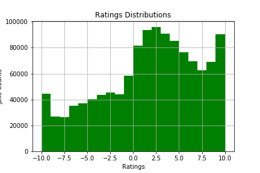
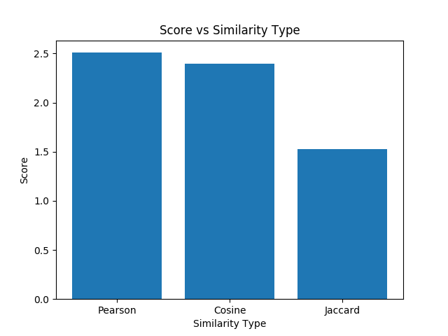
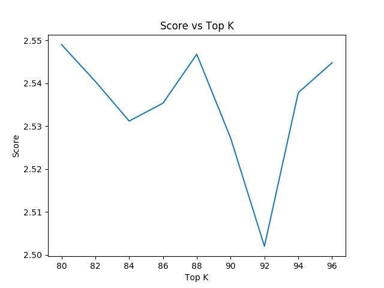

# Not Funny!: A Joke Recommendation System 

### Tyler Watson & Kevin Magaña, Dec. 17th, 2017

## The Challenge: 
Build a recommender system based off of data from the Jester Dataset, which includes user ratings of over 100 jokes. The Berkley dataset includes over a million user ratings. 

- Task: Build a recommendation system for jokes
- Data: User ratings ranging from -10 to 10
- Scoring: Mean rating for top 5% of jokes predicted by recommender
- Tools: GraphLab, Pandas

## Exploratory Data Analysis 

 

- More people gave positive ratings, than negative 
- 10 & -10 were more common than less extreme ratings

## The Goal: 
The goal is to build a recommendation system to suggest jokes to users. We will score the model based off of how well we
predicted the mean of the top-rated jokes for the user ratings in our test set. 

## How: 
We implemented item similarity recommenders (using cosine, pearson, and jaccard similarity types) and factorization
recommenders using GraphLab. 

 

- Pearson results in the best similarity indicator; focuses on direction rather that distance 

 

- Score of item similarity vs. the number of the top K similar items
- Looks like the best K-nearest items is about 80 

 

- Score vs. Number of latent features
- 8 Latent features, or the default seems to be produce optimal scores 

