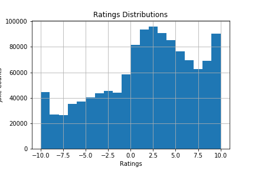

# Not Funny!: A Joke Recommendation System
### By: Tyler Watson & Kevin Magaña, December 18th, 2017

## The Challenge: 

Build a recommender system based off of data from the Jester Dataset, which includes user ratings of over 100 jokes. The dataset includes over a million user ratings. 

## Exploratory Data Analysis 

 

## The Goal: 
The goal is to build a recommendation system to suggest jokes to users. We will measure score will be measured based off of how well you predict the top-rated jokes for the users' ratings in our test set.

## How: 
We implemented item similarity recommenders (using cosine, pearson, and jaccard similarity types) and factorization recommenders using GraphLab

 

 

